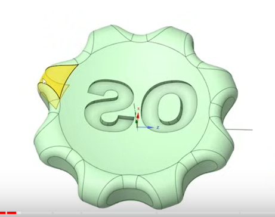
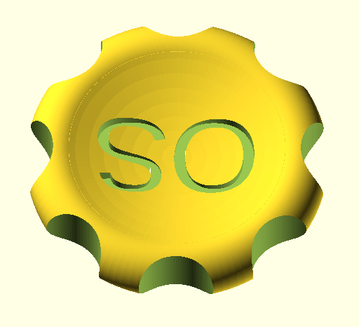
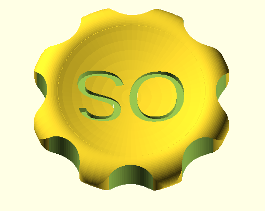
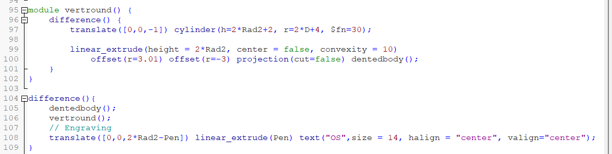

# OS Makers Coin

After coming across the following youtube video [The test model - a Makercoin!](https://youtu.be/J--QVhGheP4?si=2gMVAXiiAnTDSyM6&t=131) I thought I 
might try making a makers coin using OpenSCAD. It seemed expedient to see if anyone else had done it already. Using Google I found another video with 
a link in the description to an scad file for a makercoin. This scad model appeared to be the same as the design presented in the Makers Muse video 
except it lacked the rounded edge. OpenSCAD is challenged when it comes to rounds and fillets. I was able to add a linear round but not the round that 
follows an arbitrary curve.

## Original Model of Makercoin

See [Makers Muse Makers Coin](https://youtu.be/J--QVhGheP4?si=ViFuPejY_bHTWcpQ&t=616)

## Found SCAD version of Makercoin

See [jean-michel Eich Maker Coin with OpenSCAD](https://youtu.be/l6qVk96XqXg?si=T36X0i81p4USCh-O&t=764)

The SCAD file can be found here: [Google drive folder](https://drive.google.com/drive/folders/1i3NBs0-63ScLgKOvN0vD6tYy1J7Vj7ob)
and has been included here [MakerCoin-OS.scad](MakerCoin-OS.scad).

## Modified SCAD version of Makercoin

The only difference between this version and the version from jean-michel Eich is that the corners by the dents have been rounded with a 3mm linear curve. Even This
change slows down the render of the coin in OpenSCAD.

The modified file is here: [MakerCoin-OS-rnd.scad](MakerCoin-OS-rnd.scad)

### Method used to add round

The file is mostly as it was but the existing coin code was moved into the module **dentedbody()** .
The changes included some Boolean difference() calls as well as projection of the original coin onto the xy plane followed by offsets and linear extrusion. 

~~~~openscad
module vertround() {
    difference() {
        translate([0,0,-1]) cylinder(h=2*Rad2+2, r=2*D+4, $fn=30);
        
        linear_extrude(height = 2*Rad2, center = false, convexity = 10)
            offset(r=3.01) offset(r=-3) projection(cut=false) dentedbody();
    }
}

difference(){   
    dentedbody();
    vertround();
    // Engraving
    translate([0,0,2*Rad2-Pen]) linear_extrude(Pen) text("OS",size = 14, halign = "center", valign="center");
}
~~~~

With syntax highlighting:

